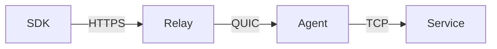
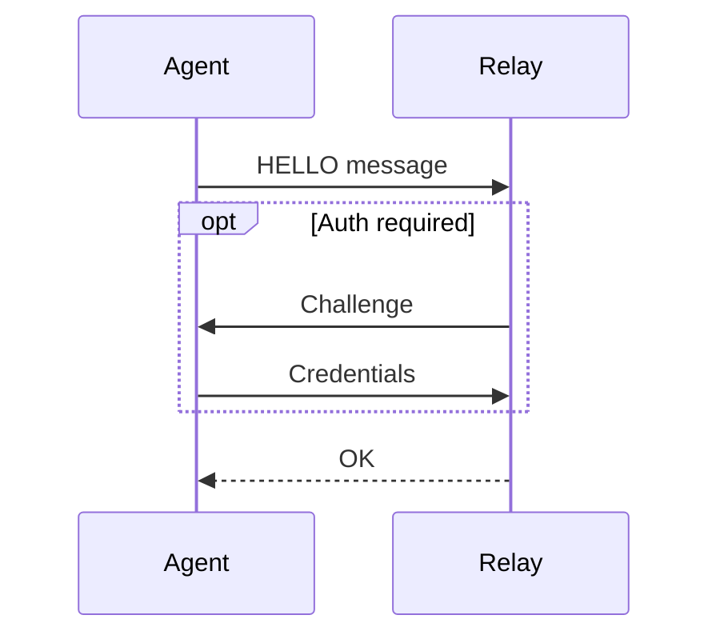
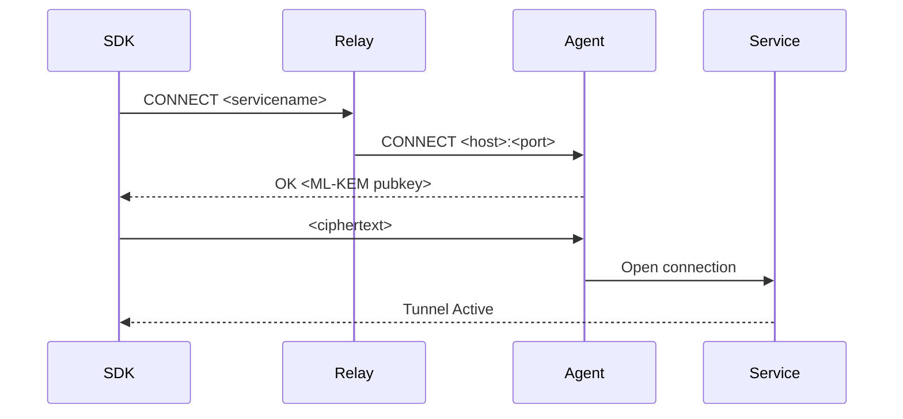

# Hardpoint Connect Protocol Spec

*Version*: 1.0
*Date* April 2026

---

## Overview

This details the spec for the wire protocol used by the agent (otherwise known as `hardpointd`) to establish a tunnel and handle traffic between Hardpoint's managed infrastructure.

The protocol is a simple, framed, text-based state machine sitting on top of [QUIC](https://en.wikipedia.org/wiki/QUIC), HTTP and TLS primitives.

## Terminology

* SDK: The initiator of a tunneling request. Presents an identity (e.g. OIDC token) and a named service and exposes a stream for upstream client libraries such as database drivers to transparently communicate with the remote service across an established tunnel
* Agent/`hardpointd`: used interchangeably to refer to a daemon running inside a private network which constitutes one end of a Hardpoint Connect Protocol tunnel. It makes an outbound connnection to the Relay but is not publicly reachable
* Relay: the touchpoint within Hardpoint's managed network mesh which constitutes the receiving end of a Hardpoint Connect Protocol tunnel. Evaluates whether SDKs with a given presented identity are allowed to access services they're requesting, and forwards traffic if they are
* Service: TCP-based server running somewhere within the same network as the agent, but not publicly accessible. Agents relay traffic to services when they receive traffic requests from the Hardpoint network

## Details

### Transports

Due to the constraints of various infrastructure components, Hardpoint Connect uses a variety of transports:

Connections from SDK -> Relay and Agent -> Relay mandate TLS 1.3. TLS hardens the connection against MITM interception from the open internet, although since the Relay is not a trusted component in our threat model, we use an additional ML-KEM. Given Hardpoint's current emphasis on the DevEx for TypeScript/JS-based applications running in ephemeral environments such as a Vercel function or a Fly.io machine, the SDK -> Relay communication is implemented as a HTTP CONNECT proxy.

### Versioning

The protocol heavily uses QUIC primitives. Since QUIC mandates transport encryption, a protocol value is required for NPN to complete properly. The value is set to `hp-<version>` where `<version>` is the latest protocol version, i.e. `hp-1.0`.

Forward & backward compatibility guarantees are not defined at this time.

### Commands

The protocol consists of the following commands:

| Command | Description |
| :--- | :----: |
| `HELLO` | Sent by an agent on startup |
| `WAITPING` | Sent by an agent polling for approval status |
| `OK` | Acknoledgement with optional payload, depending on state |
| `ERROR` | Indicates something went wrong with the handshake |
| `CONNECT` | Request to connect to a service |

### Framing

Both control and data messages are framed using a varint-style framing mechanism with 2 equivalent implementations in [TypeScript](https://github.com/hardpointlabs/length-prefixed-stream) and [Go](https://github.com/hardpointlabs/lpstream).

### Startup message flow

The following message sequence occurs on agent startup when it tries to connect and authenticate to the relay mesh:

### Connect message flow

The following [SDK](https://github.com/hardpointlabs/sdk)-initiated message sequence occurs when a remote SDK call requests access to a resource downstream of an agent. For brevity, lines crossing the relay have been elided, however it should be understood that any message between components on either side of the Relay [e.g. between the SDK and the reciprocal Agent] will pass through the Relay.

